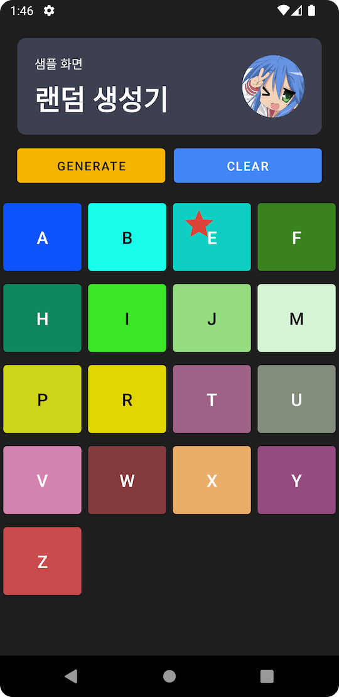

# [Sample] Code for Readability

### 구현해야하는 스펙

1. 랜덤으로 생성된 텍스트/색상을 표시하는 리스트를 만든다
2. 항목 선택시, 해당 항목에 `⭑` 표시가 되어야한다
3. 마지막으로 선택된 항목이 존재하는 경우에는 아래 조건을 대응해야한다
   1. 초기화 후 새로운 항목 노출시에도 마지막 선택된 값과 동일한 경우 `2번` 조건을 대응해야한다.

------

